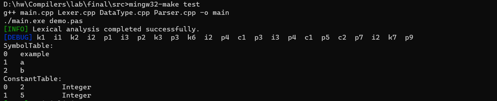
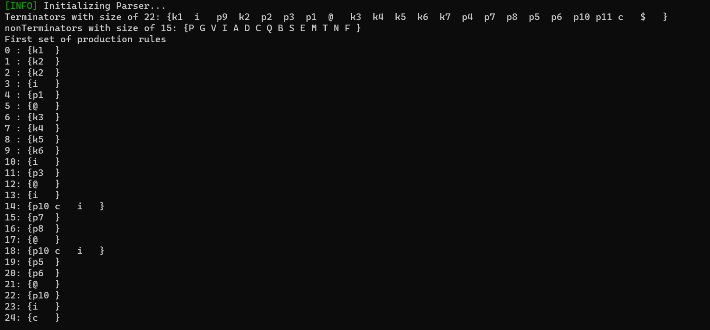
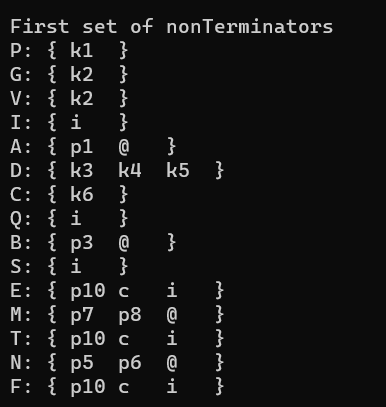
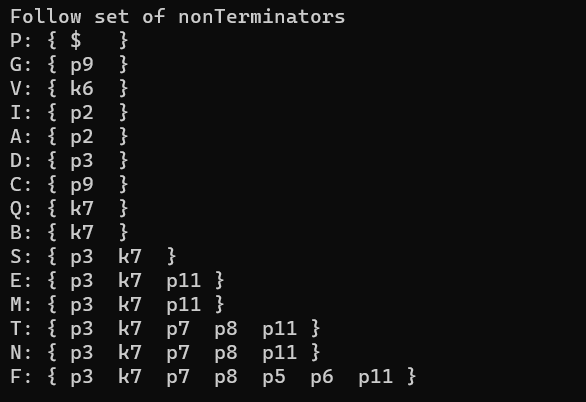
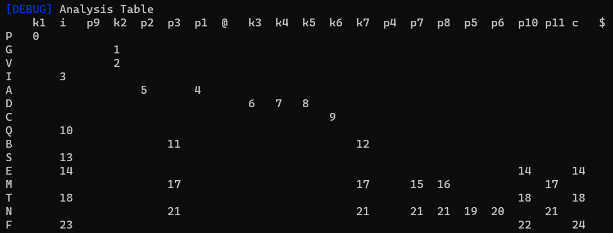
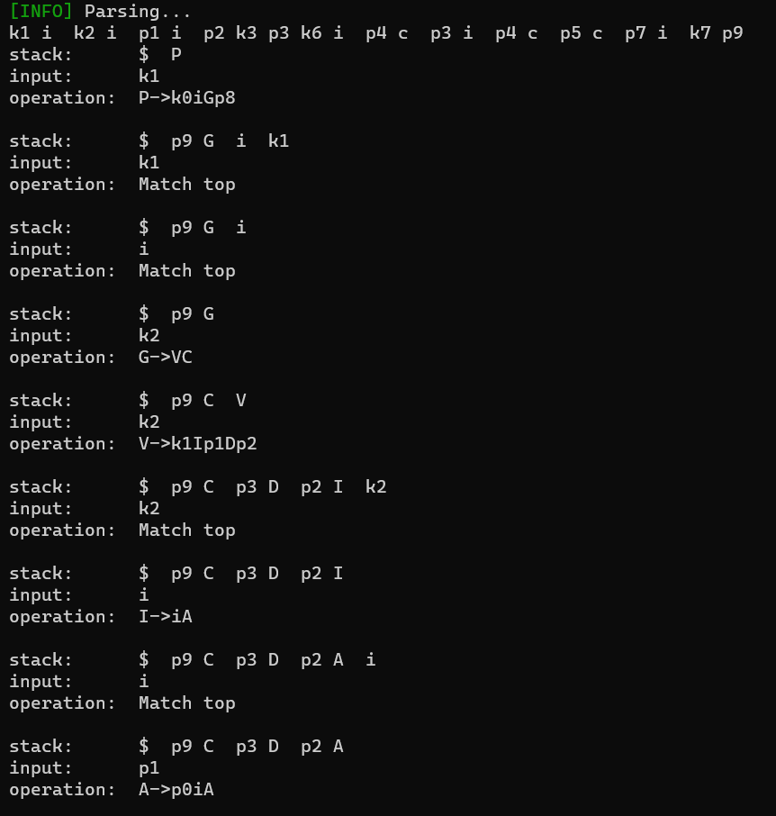
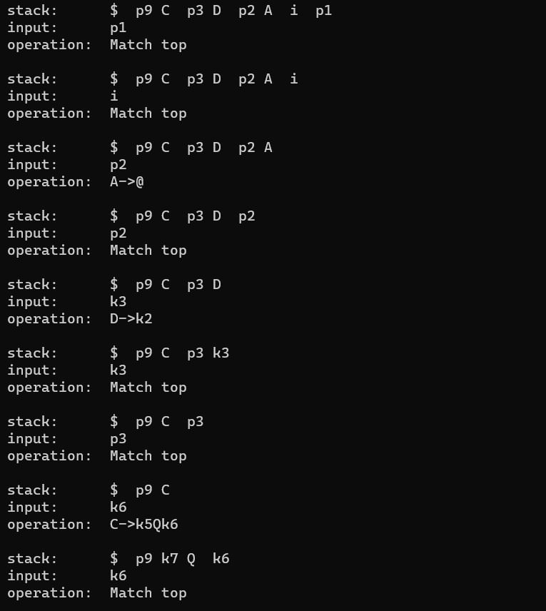
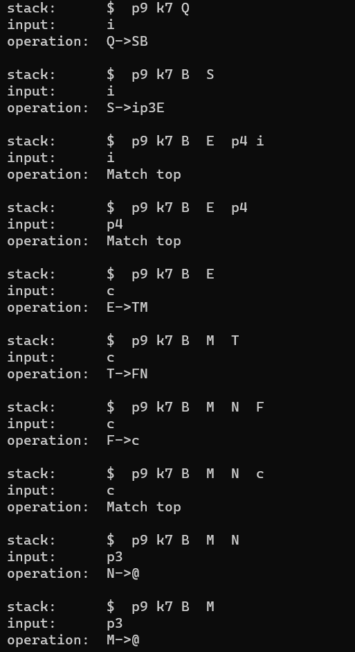
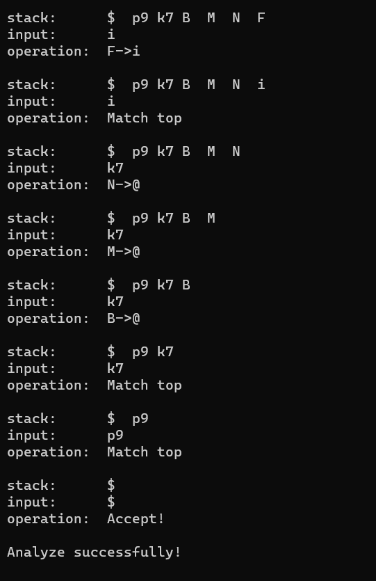

# 编译器构造实验——实验报告

19335074  黄玟瑜

## 实验要求

> 一个简单文法的编译器的设计与实现：
>
> + 一个简单文法的编译器前端的设计与实现
>   + 定义一个简单程序设计语言文法（包括变量说明语句、算术运算表达式、赋值语句；扩展包括逻辑运算表达式、If语句、While语句等）；
>   + 扫描器设计实现；
>   + 符号表系统的设计实现；
>   + 语法分析器设计实现；
>   + 中间代码设计；
>   + 中间代码生成器设计实现。
> + 一个简单文法的编译器后端的设计与实现
>   + 中间代码的优化设计与实现（鼓励）；
>   + 目标代码的生成（使用汇编语言描述，指令集自选）；
>   + 目标代码的成功运行。


## 设计说明

### 词法分析

词法分析器的功能输入源程序，按照构词规则分解成一系列单词符号。单词是语言中具有独立意义的最小单位，包括关键字、标识符、运算符、界符和常量等

1. **关键字** 是由程序语言定义的具有固定意义的标识符。例如，Pascal 中的begin，end，if，while都是保留字。这些字通常不用作一般标识符。
2. **标识符** 用来表示各种名字，如变量名，数组名，过程名等等。
3. **常数**  常数的类型一般有整型、实型、布尔型、文字型等。
4. **运算符** 如+、-、*、/等等。
5. **界符**  如逗号、分号、括号、等等。

#### 识别规则

各个Token类的识别规则如下（本实验所实现的自动机的识别范围）：

| 类别         | 识别规则                                      | 种别码 |
| ------------ | --------------------------------------------- | ------ |
| 关键字       | program、var、integer、real、char、begin、end | 1~7    |
| 标识符       | c(c\|d)*  (c为字母，d为数字)                  | 32     |
| 常数         | d+、'c'、d+.d+，(c为字母，d为数字)            | 33~35  |
| 界符及运算符 | (、)、-、*、/、+、:\=、;、:、,、.             | 36~71  |

#### 自动机设计

##### 上下文无关文法

> <单词> → <标识符> | <关键字> | <常数> | <界符及运算符>
> <标识符> → <字母> | <标识符> <数字> | <标识符> <字母>
> <关键字> → program | var | integer | real | char | begin | end
> <常数> → <整数> | <实数> | '<字母>'
> <界符及运算符> →  ( | ) | - | * | / | + | :\= | ; | : | , | .
> <整数> → <数字> | <整数> <数字>
> <实数> → <整数> . <整数>
> <字母> → A|B|C|…|Z|a|b|c|…|z
> <数字> → 0|1|2|3|4|5|6|7|8|9

**注释**

注释的识别规则为：//+换行符，识别到注释时可以跳过。

##### 字符集

| 类别     | 字符             |
| -------- | ---------------- |
| 字母     | a\~z、A\~Z       |
| 数字     | 0\~9             |
| 空白符   |                  |
| 换行符   |                  |
| 运算符   | -、*、/、+、:\=  |
| 单引号   | '                |
| 斜杠     | /                |
| 界符     | (、)、;、:、,、. |
| 非法字符 | 其他字符         |

##### 状态转换表

根据上述识别规则，可以得到8个状态，如下所示：

| 状态        | 说明                                                   |
| ----------- | ------------------------------------------------------ |
| Blank       | 起始状态，遇到非空白符时终止，同时转移到下一状态       |
| Number      | 数字状态，遇到非数字符号时终止                         |
| Letter      | 字母状态，遇到非数字、字母时终止                       |
| SingleQuote | 单引号状态，遇到换行或单引号时终止                     |
| Partial     | 界符及运算符状态，遇到任何符号都会终止（运算符长度<=2) |
| Bar         | 遇到'/'进入注释状态，遇到其他符号当作除号'/'处理       |
| Comment     | 注释状态，遇到换行符终止                               |
| Error       | 错误状态，遇到换行或空格终止                           |

因此状态转换表如下：

|             | cBlank  | cNumber     | cLetter     | cSingleQuote | cPartial                    | cNewline | cBar        | cIllegal    |
| ----------- | ------- | ----------- | ----------- | ------------ | --------------------------- | -------- | ----------- | ----------- |
| Blank       | Blank   | Number      | Letter      | SingleQuote  | Partial                     | Blank    | Bar         | Error       |
| Number      | Blank   | Number      | Error       | SingleQuote  | Number(.) or Partial(other) | Blank    | Bar         | Error       |
| Letter      | Blank   | Letter      | Letter      | SingleQuote  | Partial                     | Blank    | Bar         | Error       |
| SingleQuote | Blank   | SingleQuote | SingleQuote | Blank        | SingleQuote                 | Blank    | SingleQuote | SingleQuote |
| Partial     | Blank   | Number      | Letter      | SingleQuote  | Partial                     | Blank    | Error       | Error       |
| Bar         | Blank   | Number      | Letter      | SingleQuote  | Error                       | Blank    | Comment     | Error       |
| Error       | Blank   | Error       | Error       | Error        | Error                       | Blank    | Error       | Error       |
| Comment     | Comment | Comment     | Comment     | Comment      | Comment                     | Blank    | Comment     | Comment     |

#### 程序设计

##### 关键字表：KeyTable

关键字表如下：

| 编号 | 关键字  |
| ---- | ------- |
| 1    | program |
| 2    | var     |
| 3    | integer |
| 4    | real    |
| 5    | char    |
| 6    | begin   |
| 7    | end     |

对应数据结构如下：

```cpp
vector<KeyType> KeyTable = {
	KeyType::PROGRAM,		// program
	KeyType::VAR,			// var
	KeyType::INTEGER,		// integer
	KeyType::REAL,			// real
	KeyType::CHAR,			// char
	KeyType::BEGIN,			// begin
	KeyType::END			// end
};

```


##### 界符表：PartialTable

界符表如下：

| 编号 | 界符 |
| ---- | ---- |
| 1    | ,    |
| 2    | :    |
| 3    | ;    |
| 4    | :=   |
| 5    | *    |
| 6    | /    |
| 7    | +    |
| 8    | -    |
| 9    | .    |
| 10   | (    |
| 11   | )    |

对应数据结构如下：

```cpp
vector<PartialType> PartialTable = {
	PartialType::COMMA, 		// ,
	PartialType::COLON,			// :
	PartialType::SEMICOLON,		// ;
	PartialType::ASSIGN,		// :=
	PartialType::MUL,			// *
	PartialType::DIV,			// /
	PartialType::ADD,			// +
	PartialType::SUB,			// -
    PartialType::DOT,			// .
	PartialType::LB, 			// (
	PartialType::RB				// )
};
```


##### 符号表：SymbolTable

符号表是词法分析过程的产物，因此定义其数据结构如下：

```cpp
class symbolTable{
public:
	struct Entry{
		string name;
		DataType type;
		Category cat;
		uint64_t addr;
		
		Entry(string id)
		{
			name = id;
		}
	};

	vector<Entry> table;
	// add an entry to the symbol table
	void addEntry(string name);
	// get index of the entry specified by name
	int getIndex(string name) const;
	// print the symbol table
	void print() const;
};

symbolTable SymbolTable;
```

每一个表项为Entry，标识、数据类型、类别以及地址：

| NAME | TYPE | CAT  | ADDR |
| ---- | ---- | ---- | ---- |
|      |      |      |      |

词法分析过后生成标识符表，每一个标识符的数据类型、类别以及地址在语义分析时确定。


##### 常数表：ConstantTable

常数表是词法分析过程的产物，因此定义其数据结构如下：

```cpp
class constantTable{
	struct Entry{
		DataType type;
		int offset;

		Entry(DataType t, int of)
		{
			type = t;
			offset = of;
		}
	};
public:
	char* buffer;
	int p;
	vector<Entry> table;

	constantTable(){ buffer = (char*) malloc(1024); p = 0; }
	~constantTable(){ free(buffer); }

	// add an entry to the constant table
	template<typename T>
	void addEntry(T value, DataType type);

	// get index of the entry specified by data type and value
	template<typename T>
	int getIndex(T value, DataType type) const;

	// print the constant table
	void print() const;
};

constantTable ConstantTable;
```

每一个表项包含数据类型以及其在常数存储区的地址，在访问时通过数据类型以及其在常数存储区的地址即可读取数据。


##### Token序列：Tokens

Token包括4种类型，分别为关键字、界符、标识符以及常数，Token序列用Tokens类来封装，如下所示：

```cpp
enum TokenKind
{
	KEY,		// Keys
	PARTIAL,	// Partials
	ID,			// Identifiers
	CONSTANT	// Constants
};
class Token {
	private:
		// token kind
		TokenKind kind;
		// token index
		int index;
		// location
		size_t line;
		size_t column;

	public:
		// constructor
		Token();
		Token(TokenKind kind, int index, size_t line = 0, size_t column = 0);
		// accesser
		TokenKind GetKind();
		int GetIndex();
		size_t GetLine();
		size_t GetColumn();
		void print() const;
};

class Tokens {
private:
	vector<Token> tokens_;

public:
	void push(Token token);
	void push(TokenKind kind, int index, size_t line = 0, size_t column = 0);
	void clear();
	void append(Tokens tokens);
	vector<Token>::iterator begin();
	vector<Token>::iterator end();
	Token back();
	size_t size() const;
	void printTokens() const;
};
```


##### 词法分析器：Lexer

词法分析器设计如下：

```cpp
class Lexer {
private:
	enum Status {
		Blank,
		Number,
		Letter,
		SingleQuote,
		Partial,
        Bar,
		Error,
		Comment,
	};
	enum CharType {
		cBlank,
		cNewline,
		cNumber,
		cLetter,
		cSingleQuote,
		cPartial,
        cBar,
		cIllegal,
	};

	bool isBlank(char c);
	bool isNewline(char c);
	bool isNumber(char c);
	bool isLetter(char c);
	bool isSingleQuote(char c);
	bool isPartial(char c);
	bool isBar(char c);
	CharType getCharType(char c);

public:
	// Lexical Analysis function
	void AnalyseTokens(ifstream& sourceCode, ErrorMsgs& errorMsgs, Tokens& tokens);	
    // interface for main function
	void run(char * inputfile, Tokens& tokens);		
};

```

词法分析器会对源文件进行分析，输出分析得到的Token序列tokens。

### 语法分析

#### 文法设计

文法设计如下：

> PROGRAM → program id SUB_PROGRAM.
>
> SUB_PROGRAM → VARIABLE COM_SENTENCE
>
> VARIABLE → var ID_SEQUENCE ：TYPE ；
>
> ID_SEQUENCE → id {，id}
>
> TYPE → integer | real | char
>
> COM_SENTENCE → begin SEN_SEQUENCE end
>
> SEN_SEQUENCE → EVA_SENTENCE {；EVA_SENTENCE }
>
> EVA_SENTENCE → id := EXPRESSION
>
> EXPRESSION → EXPRESSION + TERM | EXPRESSION - TERM | TERM
>
> TERM → TERM * FACTOR | TERM / FACTOR | FACTOR
>
> FACTOR → id | cons | ( EXPRESSION ) 
>
>   其中：id为标识符，cons为常数。

终结符的种类分为k（关键字）、p（界符）、i（标识符）、c（常数）共四种类别，对应此外分析输出的Token种类，而关键字类别、界符类别的终结符是一字一种的，标识符和常数一类一种。

上述文法表示如下（已消除左递归）：

> P → k[program]iGp[.]
>
> G → VC
>
> V → k[var]Ip[:]Dp[;]
>
> I → iA
>
> A→p[,]iA
>
> A→@
>
> D →k[integer]
>
> D →k[real]
>
> D→k[char]
>
> C → k[begin]Qk[end]
>
> Q → SB 
>
> B→p[;]SB
>
> B→@
>
> S → ip[:=]E
>
> E→TM
>
> M→p[+]TM
>
> M→p[-]TM
>
> M→@
>
> T→FN
>
> N→p[*]FN
>
> N→p[/]FN
>
> N→@
>
> F→p[(]Ep[)]
>
> F→i
>
> F→c

将关键字以及界符和关键字表以及界符表对应起来，文法如下：

>   P->k0iGp8
>
>   G->VC
>
>   V->k1Ip1Dp2
>
>   I->iA
>
>   A->p0iA
>
>   A->@
>
>   D->k2
>
>   D->k3
>
>   D->k4
>
>   C->k5Qk6
>
>   Q->SB
>
>   B->p2SB
>
>   B->@
>
>   S->ip3E
>
>   E->TM
>
>   M->p6TM
>
>   M->p7TM
>
>   M->@
>
>   T->FN
>
>   N->p4FN
>
>   N->p5FN
>
>   N->@
>
>   F->p9Ep10
>
>   F->i
>
>   F->c


#### 程序设计

该文法为LL(1)文法，故可使用LL(1)分析法。

初始化阶段，透过输入文法生成预测分析表Analysis Table。

语法分析器将使用Analysis Table进行分析。

分析时，将token序列转化为字符串进行分析，故使用`map<char, Token> Char2Token;`、`map<int, char> Key2Char;`和`map<int, char> Partial2Char;`进行映射。

```cpp
// production rules with invisible characters, used by parser
vector<string> productionRules;

map<char, Token> Char2Token;
map<int, char> Key2Char;
map<int, char> Partial2Char;

char startChar; 

vector<vector<int>> AnalysisTable;
```

语法分析器如下：

```cpp
class Parser{
    vector<char> nonTerminators;
    vector<char> Terminators;
    vector<set<char>> pFirstSets;   // the same size of productionRules
    vector<set<char>> nFirstSets;   // the same size of nonTerminators
    vector<set<char>> nFollowSets;  // the same size of nonTerminators

    int indexOf(const vector<char>& v, char x);

    void getFirstOfNonTerminator(char nonTerminator);
    void getFirstOfProductionRules();
    set<char> firstBate(const string& remain);
public:
    Parser();
    void printCharacters();
    void printFirst();
    void printFollow();
    void printTable();
    void printC(char c);
    void printCurrentStatus(const string& s1, const string& s2, char c);
    void AnalyseSentence(const string& sentence);
    void run(Tokens& tokens);		// interface for main function
};
```

### 语义分析

#### 翻译文法的设计

> P → k[program]{PUSH(i)}i{PUSH(i)}{GEQ(k[program])}G{GEQ(k[end])}p[.]
>
> G → VC
>
> V → k[var]Ip[:]Dp[;]
>
> I → iA
>
> A→p[,]iA
>
> A→@
>
> D →k[integer]
>
> D →k[real]
>
> D→k[char]
>
> C → k[begin]Qk[end]
>
> Q → SB 
>
> B→p[;]SB
>
> B→@
>
> S → ip[:=]E
>
> E→TM
>
> M→p[+]T{GEQ(+)}M
>
> M→p[-]T{GEQ(-)}M
>
> M→@
>
> T→FN
>
> N→p[\*]F{GEQ(\*)}N
>
> N→p[/]F{GEQ(/)}N
>
> N→@
>
> F→p[(]Ep[)]{PUSH(RES(E))}
>
> F→i{PUSH(i)}
>
> F→c{PUSH(c)}

### 中间代码优化

#### 优化设计


#### 寄存器和变量分配


## 结果测试

#### 词法分析器——token序列

词法分析的结果如下，符合预期。

**预期结果**

Token序列：

> (k,1),(i,1), (k,2),(i,2),(p,1),(i,3),(p,2),(k,3),(p,3),(k,6), (i,2),(p,4),(c,1),(p,3), (i,3),(p,4),(c,1),(p,5),(c,2),(p,7),(i,2),(k,7),(p,9),

符合表I：

| NAME    | TYPE | CAT  | ADDR |
| ------- | ---- | ---- | ---- |
| example |      |      |      |
| a       |      |      |      |
| b       |      |      |      |
|         |      |      |      |

常数表：

| 2    |
| ---- |
| 5    |

**输出结果**




#### 语法分析器——程序的文法正确性判断

##### 终结符与非终结符，产生式的FIRST集



##### 非终结符的FIRST集



##### 非终结符的FOLLOW集



##### 预测分析表



##### 分析过程









对于实验给出的实例，通过语法分析。

#### 语义分析器——中间代码生成

#### 中间代码优化——优化后的中间代码

#### 代码生成——生成的目标代码

#### 目标代码的运行成果