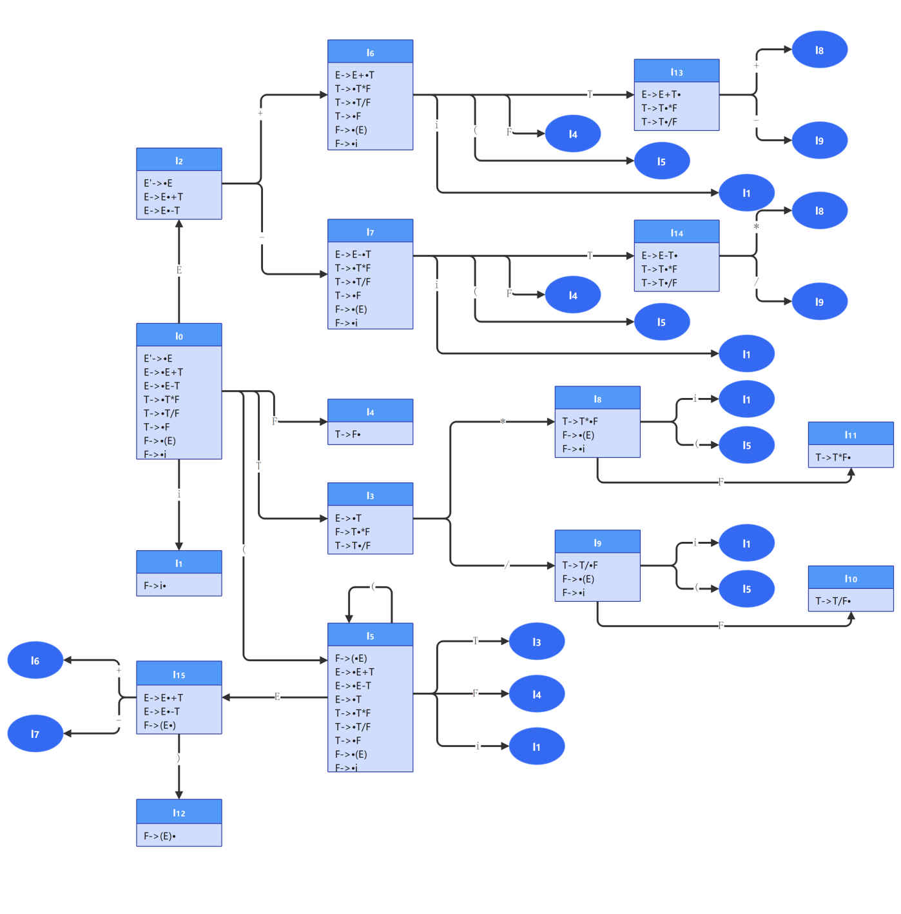

# 语法分析器的设计与实现

|学号 |姓名 |
|---|---|
|19335074 |黄玟瑜 |


## 实验内容

### 实验要求
使用**LL(1)分析法**和**LR分析法**设计实现算术表达式的语法分析器
- 算数表达式至少支持加减乘除以及括号操作，即（+，-，*，/，（））。

### 提交内容
1. 实验报告，报告内容必须包含：
   + 算术表达式所依据的文法；
   + LL(1)和LR分析法所使用的分析表，以及简要分析；
   + 程序执行流程；
   + 程序运行结果展示。

2. 语法分析源程序：source.c（源程序包）

3. 可执行文件

4. 程序测试文件：test.txt（实验输入，将测试案例写入程序的，可没有此项）

## 实验报告

在本次实验中，笔者根据算术表达式所依据的文法，分别使用LL(1)分析法和LR分析法进行语法分析，并编程实现了两种方法的语法分析器，分别对应文件夹`LL(1)-Parser`和`LR-Parser`。


### 文法

算数表达式由如下的文法产生：
> E $\rightarrow$ E+T | E–T | T 
> 
> T $\rightarrow$ T*F | T/F | F
> 
> F $\rightarrow$ (E) | i

其中i表示标识符或常数（根据实验一所支持的token类别，本次实验对包含整数和标识符的算术表达式进行语法分析）。


### LL(1)分析法

#### 预测分析表

本节简要描述生成预测分析表的过程。

##### 消除左递归文法

消除左递归后的文法如下：

> E $\rightarrow$ TE'
>
> E' $\rightarrow$ +TE' | -TE' | $\epsilon$
>
> T $\rightarrow$ FT'
>
> T' $\rightarrow$ *FT' | /FT' | $\epsilon$
>
> F $\rightarrow$ (E) | i 

后续分析使用符号A替代E'，用符号B替代T'

##### 终结符

\+ \- @ * / ( ) i $ 

##### 非终结符

E A T B F

##### 产生式的FIRST集

| 产生式 | FISRT集 |
| ------ | ------- |
| E->TA  | ( i    |
| A->+TA | \+     |
| A->-TA | \-     |
| A->@   | @     |
| T->FB  | ( i    |
| B->*FB | \*     |
| B->/FB | /     |
| B->@   | @     |
| F->(E) | (     |
| F->i   | i     |

##### 非终结符的FIRST集

| 非终结符 | FISRT集 |
| ------ | ------- |
| E       |( i        |
| A       |\+ \- @       |
| T       |( i        |
| B       |\* / @       |
| F       |( i        |

##### 非终结符的FOLLOW集

| 非终结符 | FOLLOW集 |
| ------ | ------- |
| E       |$ ) |
| A       |$ )    |
| T       |$ ) \+ \- |
| B       |$ ) \+ \-   |
| F       |$ ) \* \+ \- / |

##### 预测分析表

生成的预测分析表如下：

|    |     \+|      \- |     @|      \* |      / |      (  |     )  |     i |       $|
|----| ---- | ----   | ---- |   ---- | ----   | ----    | ----   | ----  | ----   |
|  E |      |        |      |        |        |  E->TA  |        | E->TA |        |
|  A |A->\+TA| A->\-TA |      |        |        |         |  A->@  |       |    A->@|
|  T |      |        |      |        |        |  T->FB  |        | T->FB |        |
|  B |  B->@|   B->@ |      | B->\*FB | B->/FB |         |  B->@  |       |    B->@|
|  F |      |        |      |        |        | F->(E)  |        |  F->i |        |

#### 程序执行流程

LL(1)分析的过程如下：
假设当前等待匹配的符号为a，进行匹配的非终结符为A，A的所有产生式为 A → α1 | α2 | … | αn，

+ 若 a ∈ FIRST(αi)，则将 A 推导为 αi，a得到匹配，斯巴拉西，继续分析下一个符号
+ 若 a ∉ FIRST(αi)
  + 若 ε ∈ FIRST(αi)，且 a ∈ FOLLOW(A)，则将 A 推导为 ε，a 交给 A 后面的串匹配
  + 否则，匹配失败，a 此时在输入串中是语法错误

具体实现见以下函数：

```cpp
void Parser::AnalyseSentence(const string& sentence);
```

#### 程序运行结果

在终端的运行结果如`LL(1)-Parser/CMD.txt`所示。

### LR分析法

#### 预测分析表

本节简要描述LR分析表的产生过程。

##### 拓广文法

> 0. E'->E
>1. E->E+T
> 2. E->E-T
>3. E->T
> 4. T->T*F
>5. T->T/F
> 6. T->F
>7. F->(E)
> 7. F->i

##### 文法项目


| 0. E'->·E       | 1. E'->E·       |                 |                 |
| --------------- | --------------- | --------------- | --------------- |
| 2. E->**·**E+T  | 3. E->E**·**+T  | 4. E->E+**·**T  | 5. E->E+T**·**  |
| 6. E->**·**E-T  | 7. E->E**·**-T  | 8. E->E-**·**T  | 9. E->E-T**·**  |
| 10. T->**·**T*F | 11. T->T**·***F | 12. T->T***·**F | 13. T->T*F**·** |
| 14. T->**·**T/F | 15. T->T**·**/F | 16. T->T/**·**F | 17. T->T/F**·** |
| 18. T->**·**F   | 19. T->F**·**   |                 |                 |
| 20. F->**·**(E) | 21. F->(**·**E) | 22. F->(E**·**) | 23. F->(E)**·** |
| 24. F->**·**i   | 25. F->i**·**   |                 |                 |
| 26. E->**·**T   | 27. E->T**·**   |                 |                 |
##### 识别所有活前缀的DFA

FIRST和FOLLOW集如下：

|      | FIRST集 | FOLLOW集    |
| ---- | ------- | ----------- |
| E    | ( i     | \+ \- ) $     |
| T    | ( i     | \+ \- ) $ \* / |
| F    | ( i     | \+ \- ) $ \* / |



##### LR分析表

最终得到的分析表如下：

| 状态 | i    | \+    | \-    | \*    | /    | (    | )    | $    | E    | T    | F    |
| ---- | ---- | ---- | ---- | ---- | ---- | ---- | ---- | ---- | ---- | ---- | ---- |
| 0    | S1   |      |      |      |      | S5   |      |      | 2    | 3    | 4    |
| 1    |      | R8   | R8   | R8   | R8   |      | R8   | R8   |      |      |      |
| 2    |      | S6   | S7   |      |      |      |      | ACC  |      |      |      |
| 3    |      | R3   | R3   | S8   | S9   |      | R3   | R3   |      |      |      |
| 4    |      | R6   | R6   | R6   | R6   |      | R6   | R6   |      |      |      |
| 5    | S1   |      |      |      |      | S5   |      |      | 15   | 3    | 4    |
| 6    | S1   |      |      |      |      | S5   |      |      |      | 13   | 4    |
| 7    | S1   |      |      |      |      | S5   |      |      |      | 14   | 4    |
| 8    | S1   |      |      |      |      | S5   |      |      |      |      | 11   |
| 9    | S1   |      |      |      |      | S5   |      |      |      |      | 10   |
| 10   |      | R5   | R5   | R5   | R5   |      | R5   | R5   |      |      |      |
| 11   |      | R4   | R4   | R4   | R4   |      | R4   | R4   |      |      |      |
| 12   |      | R7   | R7   | R7   | R7   |      | R7   | R7   |      |      |      |
| 13   |      | R1   | R1   | S8   | S9   |      | R1   | R1   |      |      |      |
| 14   |      | R2   | R2   | S8   | S9   |      | R2   | R2   |      |      |      |
| 15   |      | S6   | S7   |      |      |      | S12  |      |      |      |      |

#### 程序执行流程

输入：算术表达式的分析表以及待分析的符号串$\omega$

输出：若$\omega \in L(G)$，得到$\omega$的自底向上分析，否则报错。

算法流程：

算法开始前，初始状态$S_0$在栈顶，带终结符的符号串$\omega\$$在输入缓冲区中。

+ 使ip指向$\omega\$$的第一个符号
+ while(ip不指向$\omega\$$的末尾)
  + S<-栈顶状态，a<-ip所指向的符号
  + if(Action[S,a] == shift S')
    + 把a和S'分别压入符号栈和状态栈
    + 推荐ip，使其指向下一个输入符号
  + else if(Action[S,a] == reduce by A<-$\beta$)
    + 从符号栈和状态栈弹出$|\beta|$个元素
    + S'<-新的栈顶状态
    + 把A和Goto[S',A]分别压入符号栈和状态栈
    + 输出产生式A<-$\beta$
  + else if(Action[S,a] == accept)
    + 输出接收信息，退出
  + else
    + 输出错误信息，退出

具体实现见以下函数：

```cpp
void Parser::AnalyseSentence(const string& sentence);
```

#### 程序运行结果

在终端的运行结果如`LR-Parser/CMD.txt`所示。
